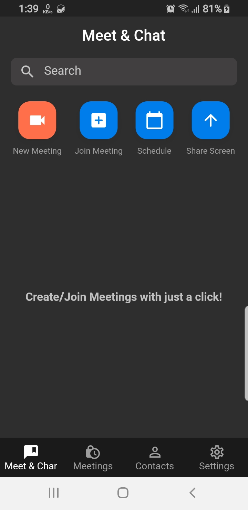
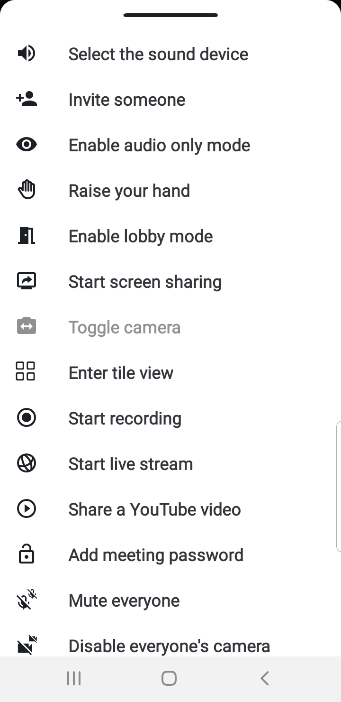

# zoom_colne_with_jitsi

#### This is a simple Tutorial on my YouTube Channel (Ramy Wahid) to learn how to clone zoom app

## See Screenshots

<table>
  <tr>
    <td></td>
     <td></td>
     <td></td>
  </tr>
  <tr>
    <td>
    <td></td>
    <td></td>
  </tr>
   
  <tr>
    <td>
    <td>
  </tr>
  
 </table>
